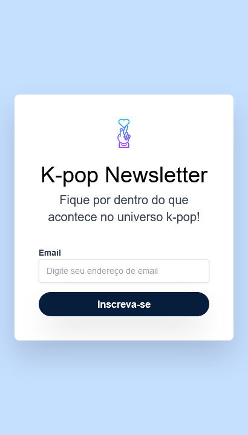
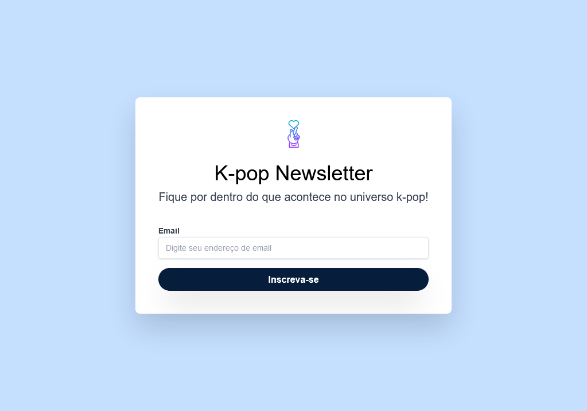
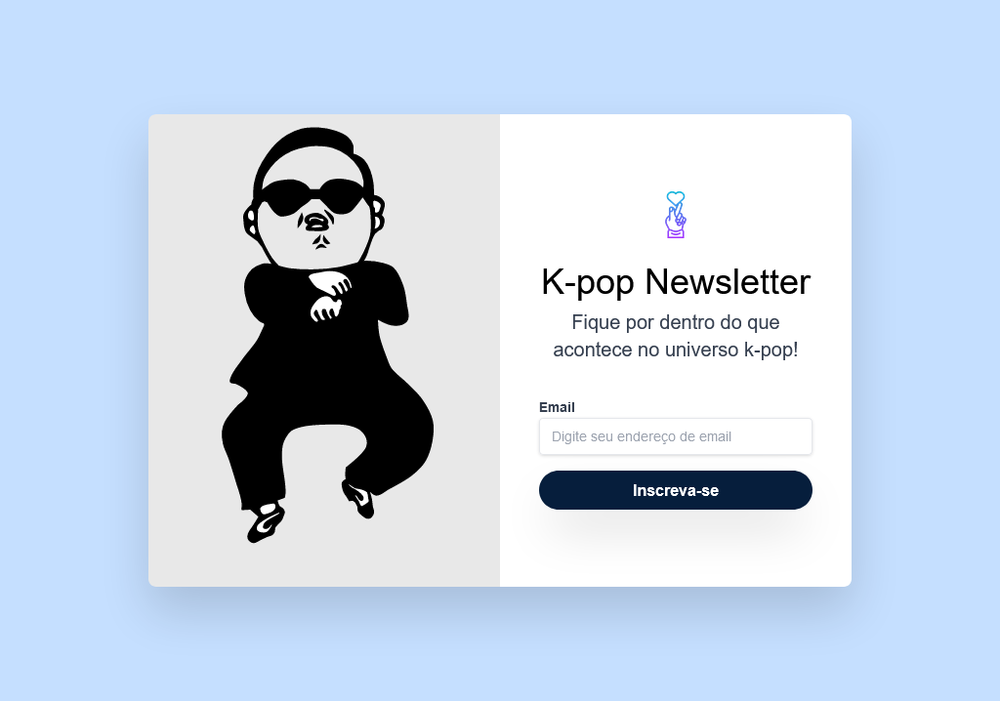
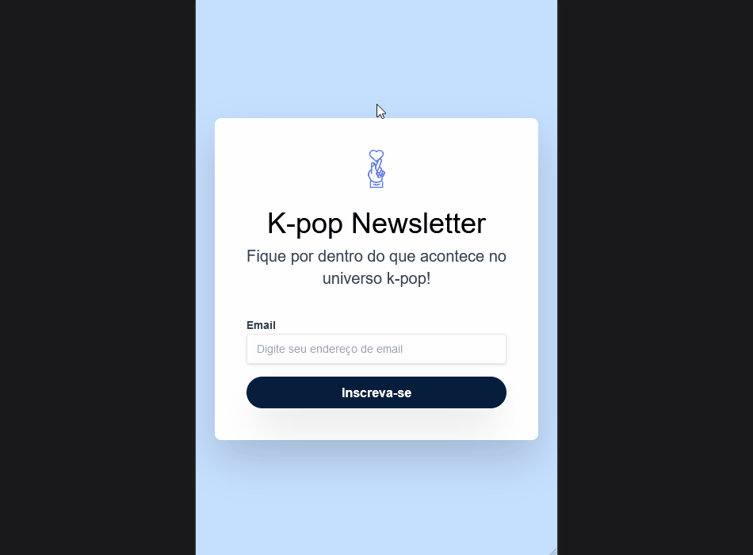

# README.md

## 📌 Introdução

Layout do campo de Newsletter, desenvolvido através do curso de front-end pela plataforma Alura, utlizando diversos conceitos e boas práticas com Tailwind.

## 🔍 Sobre a interface

## Construção da interface com Tailwind

A interface foi contruída utilizando HTML juntamente com Tailwind CSS, onde aprendi e aprimorei diversos conceitos, tais quais:

- Principais diferenças entre o Bootstrap e Tailwind;
- Utility Classes;
- Tipografias;
- Bordas e sombras;
- Uso de flex e grid;
- Pseudo-classes;
- Interatividade de elementos;
- Responsividade;
- E muito mais!

Com o curso finalizado, decidi fazer algumas alterações e tematiza-la com algo que gosto bastante, e em seguida você poderá visualizar o resultado final do projeto.

## Responsividade

O projeto foi otimizado para adaptação em telas de mobile, table e desktop, com as resoluções apresentadas abaixo.

## 📲 Midia

### Interface em 410px, até 1023px e acima de 1024px respectivamente:

## 410px

## Até 1023px

## Acima de 1024px

## Responsividade

## 🚀 Conclusão e próximos passos

Este projeto foi uma ótima oportunidade para desenvolver meus conhecimentos em Tailwind, uma ferramenta bastante poderosa no que diz respeito à criação de interfaces de usuário de forma rápida e eficiente.

Como próximos passos, pretendo explorar outras tecnologias front-end e aplicar novas técnicas em projetos pessoais. Também gostaria de aprimorar minhas habilidades em design e usabilidade para criar interfaces ainda mais atraentes e funcionais.

Agradeço à plataforma Alura por disponibilizar um curso tão completo e prático sobre front-end, e espero continuar aprendendo com a comunidade de desenvolvedores. Caso queira saber mais sobre mim ou entrar em contato, fique à vontade para acessar meu perfil no LinkedIn: https://www.linkedin.com/in/rubens-fs/.